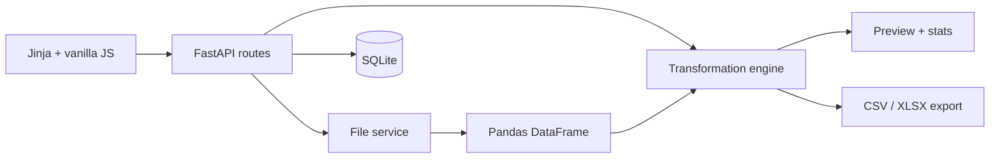

<div align="center">
  
</div>

<p align="center">
  <strong>Reusable data-cleaning workflows for CSV and Excel files.</strong><br>
  Turn recurring spreadsheet cleanup into a reviewed, repeatable recipe—without leaving your browser.
</p>

<p align="center">
  <a href="https://github.com/andyst-dev/flowforge/actions/workflows/ci.yml"></a>
  
  
  <a href="LICENSE"></a>
</p>

<p align="center">
  <a href="https://flowforge-studio.onrender.com">
    
  </a>
</p>


FlowForge is a small web app for recurring CSV and Excel cleanup. Upload a table, compose transformations, compare the result, save the recipe, and apply it to the next compatible export.

> The hosted demo has no user accounts. Saved recipes and job history are shared, storage is temporary, and sensitive data should not be uploaded. Run FlowForge locally or self-host it for private data.

## What it does

- Imports `.csv` and `.xlsx` files with validation, size limits, and useful errors
- Detects columns and profiles the source before recipe configuration
- Composes ten operations: rename, deduplicate, remove empty rows, fill missing values, trim, lowercase, uppercase, normalize dates, coerce numbers, and filter rows
- Shows before/after data plus row-level processing statistics
- Saves reusable recipes in SQLite and checks compatibility when they are rerun
- Exports processed datasets as CSV or Excel
- Records completed and failed jobs for a lightweight audit trail
- Runs locally, in Docker, or behind any ASGI-compatible deployment

## Reproducible demos

The live interface includes three one-click workflows. Each uses a deterministic dataset and its matching reusable recipe:

- **Customer cleanup** ([dataset](samples/customer_data_dirty.csv), [recipe](samples/customer_cleanup_recipe.json)) — `1,253 → 1,187` rows from a CRM export with mixed dates, missing phone numbers, inconsistent casing, padded whitespace, invalid currency values, and duplicates
- **Sales report cleanup** ([dataset](samples/sales_report_dirty.csv), [recipe](samples/sales_report_recipe.json)) — `18 → 11` rows after normalizing transaction data and removing invalid, cancelled, returned, and duplicate records
- **Inventory catalog cleanup** ([dataset](samples/inventory_dirty.csv), [recipe](samples/inventory_cleanup_recipe.json)) — `16 → 14` rows after resolving duplicate SKUs, missing values, inconsistent casing, and invalid stock or cost fields

Apply [`customer_cleanup_recipe.json`](samples/customer_cleanup_recipe.json) to reproduce this exact run:

```text
1,253 input rows
    − 41 duplicate rows
    − 25 rows with invalid numeric values
────────────────────────
1,187 clean rows exported
```

These counts are asserted by the test suite against the checked-in expected result, [`customer_data_clean_expected.csv`](samples/customer_data_clean_expected.csv).

### Before / after

| Field | Before | After |
|---|---|---|
| `first_name` | `" AVERY "` | `"avery"` |
| `email` | `" Avery.Chen0@Example.COM "` | `"avery.chen0@example.com"` |
| `state` | `zh` | `ZH` |
| `signup_date` | `01/16/2021` | `2021-01-16` |
| `lifetime_value` | `1,250` | `1250` |
| `phone` | _(missing)_ | `Not provided` |

## Architecture



HTTP routes, persistence, file handling, schemas, and transformation logic live in separate modules. SQLite uses the standard library; this v1 does not need an ORM or background queue.

## Stack

| Layer | Choice |
|---|---|
| API | FastAPI + Pydantic |
| Data engine | Pandas + OpenPyXL |
| Interface | Jinja2, semantic HTML, CSS, lightweight vanilla JavaScript |
| Persistence | SQLite |
| Quality | pytest, Ruff, coverage |
| Delivery | Docker, Docker Compose, GitHub Actions |

## Quick start

Requirements: Python 3.12 or newer.

```bash
git clone https://github.com/andyst-dev/flowforge.git
cd flowforge
python3 -m venv .venv
source .venv/bin/activate
python -m pip install -e ".[dev]"
python -m uvicorn app.main:app --reload
```

Open [http://localhost:8000](http://localhost:8000). Interactive API documentation is available at [http://localhost:8000/docs](http://localhost:8000/docs).

On Windows, create the environment with `py -3.12 -m venv .venv` and activate it with
`.venv\Scripts\activate`. The defaults work without configuration. To use the optional `make dev`
shortcut or override storage paths, upload limits, preview size, and file retention, copy
`.env.example` to `.env`; the Make target loads it automatically.

## Docker

```bash
docker compose up --build
```

The Compose volume preserves recipes and job history between container runs. The app is then available on port `8000`.

### Free portfolio deployment

The public demo runs at [flowforge-studio.onrender.com](https://flowforge-studio.onrender.com).
The included `render.yaml` configures Docker, the health check, and temporary application storage.
Free Render services spin down after inactivity and use an ephemeral filesystem, so saved recipes and
job history can reset between visits. Use a paid persistent disk for durable production data.

## Example workflow

1. Choose Customer, Sales, or Inventory under **Demo workflows**, then select **Try demo data**. You can also upload your own CSV or XLSX file.
2. FlowForge loads the matching sample and recipe, then opens the before/after report automatically.
3. Inspect the counts plus the clean/original table tabs.
4. Approve the output and download CSV or XLSX.
5. Upload the next compatible export and select the saved recipe. If a required column is missing, FlowForge identifies it before producing an output.

## API examples

Upload a file:

```bash
curl -F "file=@samples/customer_data_dirty.csv" \
  http://localhost:8000/api/uploads
```

Create a reusable recipe:

```bash
curl -X POST http://localhost:8000/api/recipes \
  -H "Content-Type: application/json" \
  --data @samples/customer_cleanup_recipe.json
```

Run a saved recipe using the `upload_id` and recipe `id` returned above:

```bash
curl -X POST http://localhost:8000/api/preview \
  -H "Content-Type: application/json" \
  -d '{"upload_id":"<upload-id>","recipe_id":1}'
```

The complete, live contract—including request validation and response schemas—is exposed through FastAPI's `/docs` endpoint.

## Tests and quality

```bash
make check                 # Ruff + full pytest suite
pytest --cov=app           # include coverage
make format                # format and apply safe lint fixes
```

The transformation suite covers every operation family, invalid-value behavior, statistics, compatibility errors, filtering, and sequential recipes. API tests exercise upload limits, recipe reuse, preview, both export formats, history, security headers, and failure responses. CI runs formatting, lint, tests with a 90% coverage floor, and a container build on every pull request and push to `main`.

## Project structure

```text
flowforge/
├── app/
│   ├── routes/           # Page and JSON API endpoints
│   ├── services/         # File IO, serialization, transformation engine
│   ├── static/           # Interface CSS and JavaScript
│   ├── templates/        # Jinja dashboard
│   ├── config.py         # Environment-backed settings
│   ├── db.py             # Focused SQLite persistence
│   ├── models.py         # Domain records
│   ├── schemas.py        # Typed API and recipe contracts
│   └── main.py           # Application factory
├── samples/              # Demo datasets, reusable recipes, expected customer output
├── scripts/              # Deterministic sample generator
├── tests/                # Unit and API coverage
├── Dockerfile
├── docker-compose.yml
├── Makefile
└── pyproject.toml
```

## Operational notes

- Uploaded files and generated previews are stored under `storage/` and excluded from Git. They
  become eligible for removal after 24 hours by default; cleanup runs at startup and before each
  new upload.
- XLSX archives are limited to 100 MB after decompression to guard against unexpectedly large
  workbooks.
- Spreadsheet formulas are read as cached cell values; FlowForge does not execute macros.
- Text beginning with a spreadsheet formula prefix is escaped during export to prevent formula injection.
- Processing is synchronous and intentionally sized for small-to-medium files (15 MB by default).
- Result pickles are server-generated and addressed by unguessable IDs; user-supplied pickle files are never accepted.
- There is no authentication in v1. Recipe and job data is shared by everyone using an instance; deploy behind access controls for private use.

## Roadmap

- Recipe editing, versioning, and import/export
- Multi-sheet Excel selection
- Column profiling and type suggestions
- Streaming jobs for larger datasets
- Optional webhook/API-key workflows

## License

FlowForge is available under the [MIT License](LICENSE).
