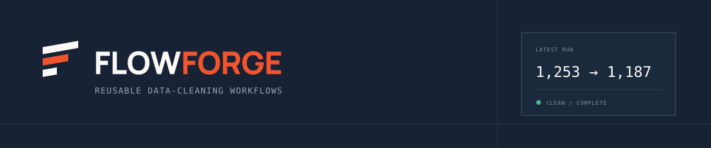
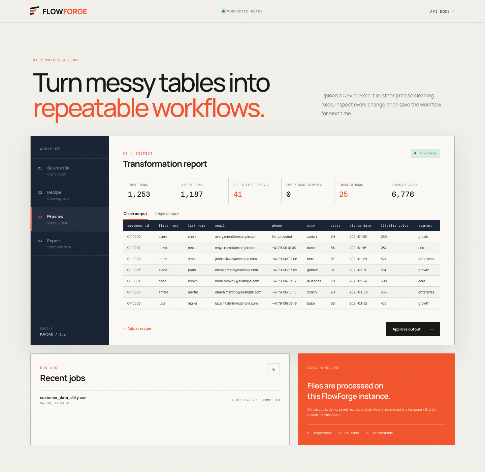
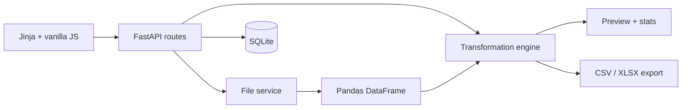

<div align="center">
  
</div>

<p align="center">
  <strong>Reusable data-cleaning workflows for CSV and Excel files.</strong><br>
  Turn recurring spreadsheet cleanup into a reviewed, repeatable recipe—without leaving your browser.
</p>

<p align="center">
  <a href="https://github.com/actions"></a>
  
  
  <a href="LICENSE"></a>
</p>

<p align="center">
  <a href="https://flowforge-studio.onrender.com">
    
  </a>
</p>



FlowForge is a compact, production-shaped data workflow app for the cleanup jobs that otherwise live in one-off notebooks and fragile spreadsheet macros. Upload a table, compose transformations, compare the result, save the recipe, and apply it to the next compatible export.

## What it does

- Imports `.csv` and `.xlsx` files with validation, size limits, and useful errors
- Detects columns and renders an immediate source preview
- Composes ten focused operations: rename, deduplicate, remove empty rows, fill missing values, trim, change casing, normalize dates, coerce numbers, and filter rows
- Shows before/after data plus row-level processing statistics
- Saves reusable recipes in SQLite and checks compatibility when they are rerun
- Exports processed datasets as CSV or Excel
- Records completed and failed jobs for a lightweight audit trail
- Runs locally, in Docker, or behind any ASGI-compatible deployment

## A real, reproducible demo

The repository includes [`customer_data_dirty.csv`](samples/customer_data_dirty.csv), a deterministic CRM-style export with mixed date formats, missing phone numbers, inconsistent casing, padded whitespace, invalid currency values, and duplicates.

Apply [`customer_cleanup_recipe.json`](samples/customer_cleanup_recipe.json) to reproduce this exact run:

```text
1,253 input rows
    − 41 duplicate rows
    − 25 rows with invalid numeric values
────────────────────────
1,187 clean rows exported
```

Those numbers come from the checked-in dataset and its generator—not a synthetic benchmark claim. The expected result is included as [`customer_data_clean_expected.csv`](samples/customer_data_clean_expected.csv).

### Before / after

| Field | Before | After |
|---|---|---|
| `first_name` | `" AVERY "` | `"avery"` |
| `email` | `" Avery.Chen0@Example.COM "` | `"avery.chen0@example.com"` |
| `state` | `zh` | `ZH` |
| `signup_date` | `01/16/2021` | `2021-01-16` |
| `lifetime_value` | `1,250` | `1250` |
| `phone` | _(missing)_ | `Not provided` |

## Architecture



The design keeps HTTP concerns, persistence, file handling, schemas, and pure transformation logic separate. SQLite access uses the standard library—there is no ORM or background queue to operate for this deliberately small v1.

## Stack

| Layer | Choice |
|---|---|
| API | FastAPI + Pydantic |
| Data engine | Pandas + OpenPyXL |
| Interface | Jinja2, semantic HTML, CSS, lightweight vanilla JavaScript |
| Persistence | SQLite |
| Quality | pytest, HTTPX, Ruff, coverage |
| Delivery | Docker, Docker Compose, GitHub Actions |

## Quick start

Requirements: Python 3.12 or newer.

```bash
git clone https://github.com/your-handle/flowforge.git
cd flowforge
python -m venv .venv
source .venv/bin/activate
pip install -e ".[dev]"
make dev
```

Open [http://localhost:8000](http://localhost:8000). Interactive API documentation is available at [http://localhost:8000/docs](http://localhost:8000/docs).

Copy `.env.example` to `.env` to override storage paths, the upload limit, or preview size. The defaults work without configuration.

## Docker

```bash
docker compose up --build
```

The Compose volume preserves recipes and job history between container runs. The app is then available on port `8000`.

### Free portfolio deployment

The public demo runs at [flowforge-studio.onrender.com](https://flowforge-studio.onrender.com).
The included `render.yaml` configures Docker, the health check, and temporary application storage.
Free Render services spin down after inactivity and use an ephemeral filesystem, so saved recipes and
job history can reset between visits. Use a paid persistent disk for durable production data.

## Example workflow

1. Upload `samples/customer_data_dirty.csv`.
2. Add the operations shown in `samples/customer_cleanup_recipe.json` or save them once through the interface.
3. Run the preview and inspect the counts plus clean/original table tabs.
4. Approve the output and download CSV or XLSX.
5. Upload the next customer export and select the saved recipe. If a required column is missing, FlowForge identifies it before producing an output.

## API examples

Upload a file:

```bash
curl -F "file=@samples/customer_data_dirty.csv" \
  http://localhost:8000/api/uploads
```

Create a reusable recipe:

```bash
curl -X POST http://localhost:8000/api/recipes \
  -H "Content-Type: application/json" \
  --data @samples/customer_cleanup_recipe.json
```

Run a saved recipe using the `upload_id` and recipe `id` returned above:

```bash
curl -X POST http://localhost:8000/api/preview \
  -H "Content-Type: application/json" \
  -d '{"upload_id":"<upload-id>","recipe_id":1}'
```

The complete, live contract—including request validation and response schemas—is exposed through FastAPI's `/docs` endpoint.

## Tests and quality

```bash
make check                 # Ruff + full pytest suite
pytest --cov=app           # include coverage
make format                # format and apply safe lint fixes
```

The transformation suite covers every operation family, invalid-value behavior, statistics, compatibility errors, filtering, and sequential recipes. API tests exercise upload, recipe reuse, preview, both export formats, history, and failure responses. CI runs lint and tests on every pull request and push to `main`.

## Project structure

```text
flowforge/
├── app/
│   ├── routes/           # Page and JSON API endpoints
│   ├── services/         # File IO, serialization, transformation engine
│   ├── static/           # Interface CSS and JavaScript
│   ├── templates/        # Jinja dashboard
│   ├── config.py         # Environment-backed settings
│   ├── db.py             # Focused SQLite persistence
│   ├── models.py         # Domain records
│   ├── schemas.py        # Typed API and recipe contracts
│   └── main.py           # Application factory
├── samples/              # Dirty input, expected output, demo recipe
├── scripts/              # Deterministic sample generator
├── tests/                # Unit and API coverage
├── Dockerfile
├── docker-compose.yml
├── Makefile
└── pyproject.toml
```

## Operational notes

- Uploaded files and generated previews are stored under `storage/` and excluded from Git.
- Spreadsheet formulas are read as cached cell values; FlowForge does not execute macros.
- Processing is synchronous and intentionally sized for small-to-medium files (15 MB by default).
- Result pickles are server-generated and addressed by unguessable IDs; user-supplied pickle files are never accepted.
- There is no authentication in v1. Deploy behind appropriate access controls if exposed beyond a trusted environment.

## Roadmap

- Recipe editing, versioning, and import/export
- Multi-sheet Excel selection
- Column profiling and type suggestions
- Streaming jobs for larger datasets
- Optional webhook/API-key workflows

## License

FlowForge is available under the [MIT License](LICENSE).
